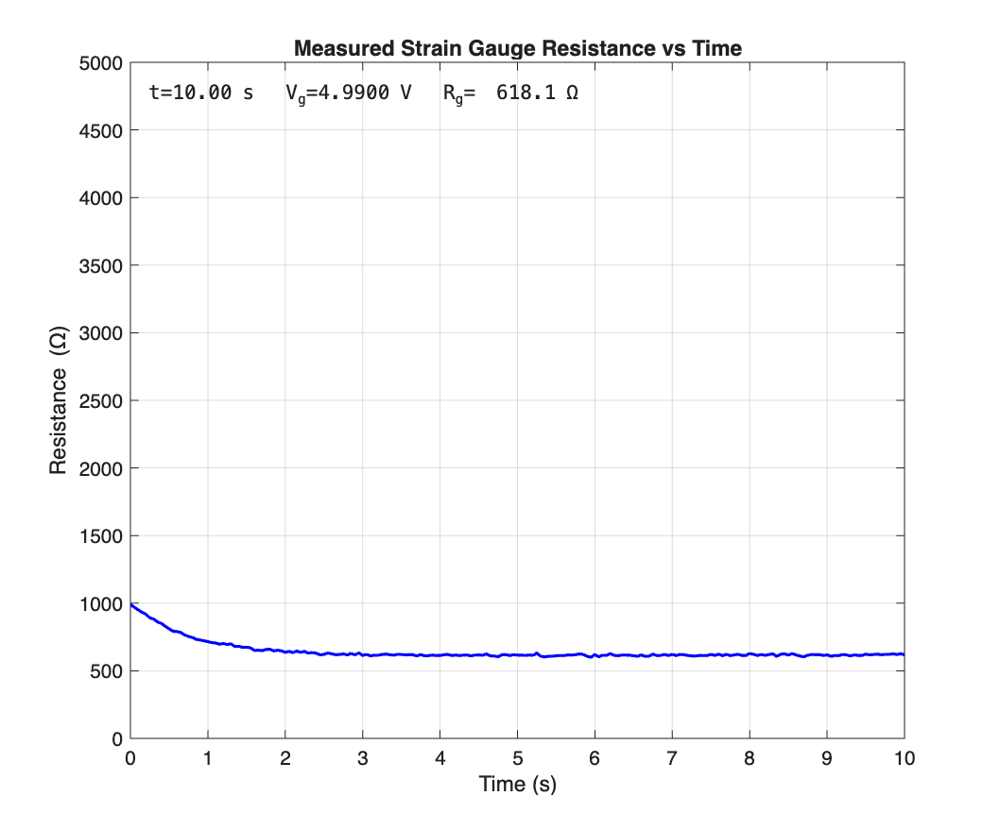
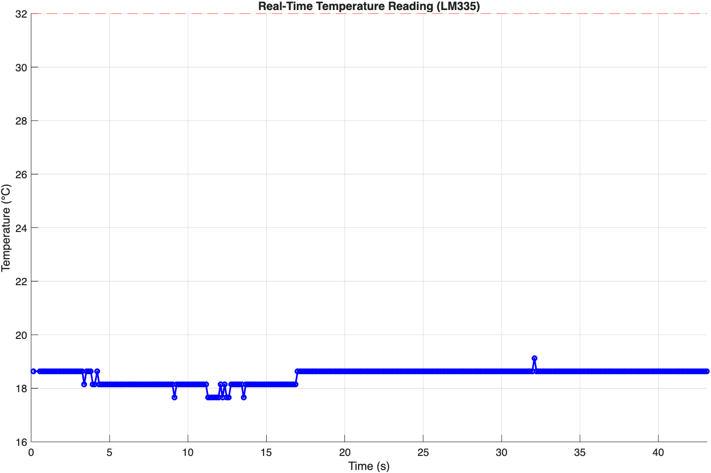

# MATLAB Sensor Data Visualization

## Overview
This repository contains MATLAB-based modeling, analysis, and visualization of time-series sensor data. The projects focus on interpreting real-world engineering measurements using mathematical modeling and publication-quality plots.

## Data and Signals
The repository includes analysis and visualization of:
- Strain gauge resistance measurements over time
- Temperature sensor (LM335) readings
- Time-series sensor data acquired from hardware experiments

## Tools
- MATLAB
- Sensor-based data acquisition
- Strain gauge
- LM335 temperature sensor

## Methods
The MATLAB workflows implemented in this repository include:
- Time-domain signal modeling and analysis
- Sensor data processing and interpretation
- Visualization of resistance and temperature trends
- Export of high-resolution figures for documentation and reporting

## Results

### Strain Gauge Resistance

### Temperature Sensor Readings (LM335)

## Hardware Setup

